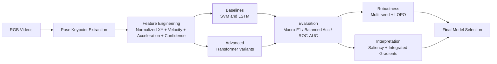

# GitHub Upload Note
Upload this markdown file together with the `visuals/` folder in the same directory.

# Tennis Skill Classification from Motion Sequences
### Final Project Presentation (No Code Version)

## 1. Motivation and Research Goal
This project studies whether player skill level can be identified from motion sequences in a way that generalizes to unseen players. The target is binary skill classification (beginner vs expert), with action classification used as an auxiliary task to improve representation learning and to reduce action-skill confounding.

## 2. Dataset and Labels
We use the THETIS dataset with four actions: backhand, forehand_flat, kick_service, and smash. The dataset contains 55 subjects and 660 total sequences, with 165 sequences per action. Skill labels are defined by subject identity: p1-p31 are beginners and p32-p55 are experts.

## 3. Evaluation Protocol
The project uses strict subject-disjoint splitting. No subject appears in more than one split. This prevents identity leakage and ensures all test results measure true generalization to new players.

## 4. Pipeline Overview
The workflow is: RGB video -> keypoint extraction -> temporal feature construction -> baseline models -> advanced models -> multi-seed evaluation -> ablation and LOPO robustness checks -> interpretation and final model selection.

## 5. Baseline Findings
Under the same split and feature pipeline, LSTM outperforms SVM on skill classification, showing that temporal modeling is necessary for this task.

## 6. Final Model Performance
The multitask Transformer provides the strongest test performance among all tested models and clearly improves over the best baseline.

## 7. Advanced Model Logic and Ablation Evidence
The advanced stage compares a skill-only Transformer, a multitask Transformer, and two ablations. Removing velocity/acceleration or normalization degrades performance, confirming that both temporal dynamics and normalization are meaningful design components.

## 8. Robustness Check with LOPO
Leave-One-Player-Out (LOPO) is used as a strict stress test across 55 held-out subjects. Variance is expected due to small per-subject test size, but Balanced Accuracy remains informative as robustness evidence.

## 9. Key Quantitative Results
- Best baseline (LSTM skill): Macro-F1 0.7348, Balanced Accuracy 0.7417, ROC-AUC 0.8086
- Best advanced (multitask Transformer, mean across seeds): Macro-F1 0.8249 ± 0.0422, Balanced Accuracy 0.8333 ± 0.0360, ROC-AUC 0.9185 ± 0.0183
- Improvement over best baseline: +0.0901 Macro-F1, +0.0917 Balanced Accuracy, +0.1100 ROC-AUC

## 11. Conclusion
The final workflow addresses all required priorities: class imbalance handling, confound-aware modeling, reliable interpretation using gradient-based attribution, and robustness reporting using multi-seed plus LOPO.

Skill classification from tennis motion sequences is feasible under strict subject-disjoint evaluation. The multitask Transformer is the recommended final model because it combines higher accuracy, stronger stability, and a confound-aware learning structure.

## 12. Limitations and Future Work
Current limits include moderate subject count and pose-estimation noise. Future extensions include larger cross-sport datasets, richer sequence modeling, and fusion of skeleton features with visual features.
